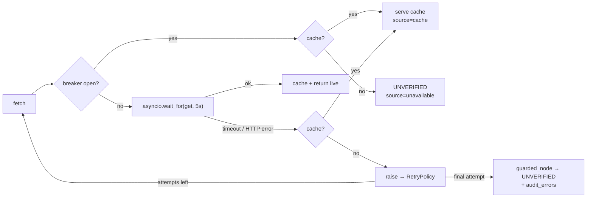

<div align="center">

# 🏥 SHA Compliance LangGraph Agent

**An asynchronous multi-agent auditor for Kenya's Social Health Authority (SHA) and Digital Health Agency (DHA) facility regulation**

[](https://github.com/pkomot/ENTERPRISE_SHA_COMPLIANCE_LANGGRAPH_AGENT/actions/workflows/ci.yml)


[Quick start](#-quick-start) •
[How it works](#-how-it-works) •
[Scoring](#-scoring--moratorium-rules) •
[Resilience](#-resilience-model) •
[API](#-programmatic-usage) •
[Configuration](#-configuration) •
[Production](#-before-production)

</div>

---

## Overview

Health facilities contracted by the **Social Health Authority** must satisfy several regulators at once:

| Regulator | Requirement checked |
|---|---|
| **ODPC** (Office of the Data Protection Commissioner) | Registered data controller/processor with a current certificate and no open enforcement notices |
| **KMPDC** (Kenya Medical Practitioners and Dentists Council) | Facility on the register, licence active, KMHFL identity matches, and declared SHA level not above the registered level |
| **DHA** (Digital Health Agency) | HMIS certified, HL7 FHIR R4 API, SNOMED CT terminology binding, CIHIS endpoint registered and syncing |

The agent runs these checks **concurrently** and computes a **deterministic compliance index**. It enforces
**SHA moratorium rules** and **pauses for a human inspector** whenever a facility is flagged. Each audit produces
a streamed JSON and Markdown scorecard, and every step is checkpointed so it can be replayed.

> [!NOTE]
> The bundled registries are **synthetic** and all demo facilities are fictional. ODPC, KMPDC and CIHIS do
> not publish the REST contracts assumed here. See [Before production](#-before-production).

### Highlights

- ⚡ **Built for low latency.** All code is `async`. ODPC and KMPDC run as parallel graph branches, lookups inside each branch run under `asyncio.gather`, and every HTTP call has a 5 s deadline.
- 🛡️ **The graph never crashes.** Pydantic v2 guards the input, `RetryPolicy` retries network nodes, a circuit breaker and last-known-good cache cover outages, and guarded nodes fall back to degraded results.
- 🧑‍⚖️ **Human in the loop.** A conditional `interrupt()` gate records the inspector's decision and justification in the audit trail.
- 🧠 **The LLM is advisory only.** `with_structured_output` parses KMPDC remarks and interprets policy, but the score and verdict are always computed by deterministic rules.
- 💾 **Auditable.** `MemorySaver` / `AsyncSqliteSaver` checkpointing supports time travel and replay.
- 📡 **Streaming.** Node updates, LLM tokens, the JSON scorecard and Markdown sections all stream.
- 🔌 **Runs offline.** Without an API key, a deterministic engine produces the same typed outputs, so CI needs no secrets.

---

## 🚀 Quick start

```bash
git clone https://github.com/pkomot/ENTERPRISE_SHA_COMPLIANCE_LANGGRAPH_AGENT.git
cd ENTERPRISE_SHA_COMPLIANCE_LANGGRAPH_AGENT
python -m venv .venv && source .venv/bin/activate      # Windows: .venv\Scripts\activate
pip install -e ".[dev,anthropic]"

python -m sha_compliance_agent                          # all demo scenarios
pytest -q                                               # 33 tests, ~8 s
```

To use Claude for extraction and narratives instead of the deterministic engine:

```bash
export ANTHROPIC_API_KEY=sk-ant-...                     # defaults to anthropic:claude-sonnet-5-5
python -m sha_compliance_agent
```

To audit your own facility payload and write the reports to disk:

```bash
python -m sha_compliance_agent \
  --payload examples/facility_payload.json \
  --decision examples/inspector_decision.json \
  --report-dir reports
```

### Demo scenarios

| Scenario | Facility (synthetic) | Result | What it demonstrates |
|---|---|---|---|
| `compliant` | Nakuru Valley Hospital, L4 | ✅ `COMPLIANT` · 1.00 | Parallel branches, streamed report, no interrupt |
| `moratorium` | Kibera Community Health Centre, L3 | ⛔ `NON_COMPLIANT` · 0.45 | No ODPC registration and no HMIS certification trigger an SHA moratorium; HITL pause, then `UPHOLD` |
| `invalid` | malformed payload | ⚠️ `AUDIT_INCOMPLETE` | Pydantic rejects the input and the run goes to `fallback_node` |
| `degraded` | Mombasa Coastline Medical Centre, declares L5 | 🔺 `ESCALATED` · 0.85 | KMPDC slowed past the timeout falls back to cache instantly; upcoding (L5 declared vs L4 registered) detected |

<details>
<summary><b>Sample console output</b></summary>

```text
SHA compliance agent | mode=mock | llm=offline (deterministic) | checkpointer=memory

=== Scenario: moratorium (thread sha-audit-a6117861-...) ===
  [node] ingest_and_validate -> VALIDATED
  [node] audit_kmpdc_node
  [node] audit_odpc_node
  [node] audit_hmis_dha_node
  [node] evaluate_compliance_scorecard -> SCORED
  [HITL] inspector review required: verdict=NON_COMPLIANT
         moratorium=['odpc.controller_registered', 'odpc.registration_current', 'dha.hmis_certified']
  [HITL] resuming with scripted decision: UPHOLD
  [node] human_review_interrupt -> REVIEWED
  [stream] scorecard: verdict=NON_COMPLIANT index=0.45
  [stream] narrative: Verdict NON_COMPLIANT at compliance index 0.45 (threshold 0.75). SHA moratorium ...
  [node] compile_final_audit_report -> COMPLETED
  [done] final verdict: NON_COMPLIANT | errors: 0 | checkpoints: 8
```

</details>

<details>
<summary><b>Sample Markdown report (excerpt)</b></summary>

> ## Verdict: NON_COMPLIANT
>
> | Metric | Value |
> |---|---|
> | Compliance index | 0.45 / threshold 0.75 |
> | SHA moratorium | YES |
> | Critical violations | 4 |
>
> | Branch | Check | Status | Critical | Source | Detail |
> |---|---|---|---|---|---|
> | ODPC | ODPC: controller registered | FAIL | yes | live | No ODPC data-controller registration found |
> | KMPDC | KMPDC: license valid | PASS | yes | live | Licence ACTIVE until 2027-01-05 |
> | DHA | DHA: hmis certified | FAIL | yes | live | No DHA HMIS certification |
>
> ## Remediation Plan
> - **P1** Register the facility as a data controller/processor with the ODPC. _(Data Protection Act, 2019)_
> - **P1** Obtain Digital Health Agency HMIS certification. _(Digital Health Act, 2023)_
> - **P2** Upgrade the HMIS API to HL7 FHIR R4 (4.0.x) and publish a CapabilityStatement. _(HL7 FHIR Release 4)_

</details>

---

## 🧭 How it works

```mermaid
flowchart TD
    S([START]) --> I[ingest_and_validate<br/><i>Pydantic v2 guardrails</i>]
    I -- invalid --> F[fallback_node]
    I -- valid --> O[audit_odpc_node]
    I -- valid --> K[audit_kmpdc_node]
    O --> H[audit_hmis_dha_node<br/><i>FHIR R4 · SNOMED CT · CIHIS</i>]
    K --> H
    H --> E{evaluate_compliance_scorecard}
    E -- "score < threshold<br/>or critical violation" --> R[/human_review_interrupt<br/><i>interrupt&#40;&#41;</i>/]
    E -- clean --> C[compile_final_audit_report]
    E -- fatal --> F
    R --> C
    F --> C
    C --> X([END])

    classDef net fill:#e8f1ff,stroke:#3b6fd8
    classDef hitl fill:#fff4e0,stroke:#d88a00
    class O,K,H net
    class R hitl
```



Blue nodes call external registries and carry a `RetryPolicy`. The ODPC and KMPDC branches run in the same
superstep, and the DHA node waits for both (a join edge).

| # | Node | Responsibility |
|---|---|---|
| 1 | `ingest_and_validate` | Validates `FacilityPayload`: KMHFL code, KMPDC reg format, level 2–6, https-only FHIR URL |
| 2a | `audit_odpc_node` | Data-controller registration, certificate expiry, open enforcement notices |
| 2b | `audit_kmpdc_node` | Register entry, KMHFL identity, licence validity, declared vs registered level; LLM extraction of inspection remarks |
| 3 | `audit_hmis_dha_node` | HMIS certification, FHIR `CapabilityStatement` (4.0.x), SNOMED CT `CodeSystem`, CIHIS sync age ≤ 7 days |
| 4 | `evaluate_compliance_scorecard` | Weighted index, moratorium rules, verdict; LLM policy interpretation |
| 5 | `human_review_interrupt` | Pauses for an `InspectorDecision`; re-prompts on invalid input (max 3) |
| – | `fallback_node` | Deterministic `AUDIT_INCOMPLETE` path for invalid input or scoring failure |
| 6 | `compile_final_audit_report` | Streams JSON scorecard, narrative tokens and Markdown sections |

### State

`AuditState` is a `TypedDict` that holds only JSON-safe values, so every checkpoint serialises cleanly.
`audit_log` and `audit_errors` are `Annotated[list, operator.add]`, which lets the parallel branches append without overwriting each other.

```python
class AuditState(TypedDict, total=False):
    payload: dict            # raw input
    facility: dict | None    # validated FacilityPayload
    odpc_result / kmpdc_result / hmis_result: dict | None
    scorecard: dict | None
    review: dict | None      # InspectorDecision
    report: dict | None      # JSON + Markdown
    status: str
    audit_log: Annotated[list[dict], operator.add]
    audit_errors: Annotated[list[dict], operator.add]
```

---

## 📊 Scoring & moratorium rules

The compliance index is the sum of weights of checks that **PASS** (FAIL and UNVERIFIED score 0).
All weights live in `CHECK_CATALOG` in [`nodes.py`](sha_compliance_agent/nodes.py).

| Check | Weight | Critical | Moratorium | Regulation |
|---|---:|:---:|:---:|---|
| `odpc.controller_registered` | 0.20 | ✔ | ✔ | Data Protection Act, 2019 |
| `odpc.registration_current` | 0.10 | ✔ | ✔ | DP (Registration) Regulations, 2021 |
| `odpc.no_enforcement_notices` | 0.05 | | | Data Protection Act, 2019 |
| `kmpdc.facility_registered` | 0.10 | ✔ | | Cap. 253 |
| `kmpdc.identity_matches` | 0.05 | ✔ | | Cap. 253 |
| `kmpdc.license_valid` | 0.15 | ✔ | | Cap. 253 |
| `kmpdc.level_matches` | 0.10 | ✔ | | Social Health Insurance Act, 2023 |
| `dha.hmis_certified` | 0.10 | ✔ | ✔ | Digital Health Act, 2023 |
| `dha.fhir_r4` | 0.08 | ✔ | | HL7 FHIR R4 |
| `dha.snomed_ct_binding` | 0.04 | | | SNOMED CT |
| `dha.cihis_endpoint_ready` | 0.03 | | | Digital Health Act, 2023 |
| **Total** | **1.00** | | | |

**Verdict logic** (applied in order):

1. Any **moratorium** check fails → `sha_non_compliant = true`, verdict **`NON_COMPLIANT`**, whatever the score.
2. Any **critical** check fails → **`NON_COMPLIANT`**.
3. Any critical check is **UNVERIFIED** (registry down, no cache) → **`PROVISIONAL`**.
4. Index < threshold (default `0.75`) → **`NON_COMPLIANT`**.
5. Otherwise → **`COMPLIANT`**.

Human review is required for cases 1–4. The inspector can choose `UPHOLD`, `OVERRIDE_COMPLIANT`, `OVERRIDE_NON_COMPLIANT`
or `ESCALATE`, with a mandatory justification of at least 20 characters. The automated verdict is kept alongside the final verdict.

---

## 🛡️ Resilience model



| Mechanism | Behaviour |
|---|---|
| **Per-call timeout** | `asyncio.wait_for(..., 5.0)` on every registry/FHIR request |
| **Cache fallback** | Last-known-good response (TTL 24 h) is returned immediately on timeout. No retry wait |
| **RetryPolicy** | `max_attempts=3`, exponential backoff with jitter, `retry_on=(httpx.HTTPError, asyncio.TimeoutError)` |
| **Circuit breaker** | Opens after 3 consecutive failures per registry, half-open probe after 30 s |
| **Guarded nodes** | Re-raise transient errors while `runtime.execution_info.node_attempt < max`. After that, or for any other exception, return degraded `UNVERIFIED` results plus a structured `audit_errors` record |
| **LLM fallback** | LLM timeout or failure switches to the deterministic engine with identical Pydantic output types |
| **Interrupt safety** | `GraphBubbleUp` (interrupts) is always re-raised, never swallowed |

---

## 🧩 Programmatic usage

```python
import asyncio

from sha_compliance_agent import AuditSettings, ComplianceAuditService, InspectorDecision
from sha_compliance_agent.mock_registries import MockRegistryServer

PAYLOAD = {
    "facility_id": "20871",
    "kmpdc_reg": "KMPDC/HF/07719",
    "declared_level": 3,
    "fhir_base_url": "https://fhir.f20871.mock/fhir",
}


async def main() -> None:
    settings = AuditSettings.from_env()
    mock = MockRegistryServer()                      # omit transport in live mode

    async with ComplianceAuditService(settings, transport=mock.transport()) as svc:
        thread_id = svc.new_thread_id()

        async for event in svc.stream_audit(PAYLOAD, thread_id=thread_id):
            match event.kind:
                case "node_update": print(f"[{event.node}]")
                case "token":       print(event.data, end="", flush=True)
                case "interrupt":   print("\nReview needed:", event.data["moratorium_triggers"])

        if (await svc.get_state(thread_id)).next:    # paused at the inspector gate
            decision = InspectorDecision(
                action="UPHOLD",
                inspector_id="SHA-INSP-0042",
                justification="Moratorium upheld pending ODPC registration.",
            )
            async for event in svc.resume_with_decision(decision, thread_id=thread_id):
                if event.kind == "token":
                    print(event.data, end="", flush=True)

        report = (await svc.get_state(thread_id)).values["report"]
        print("\n\nFinal verdict:", report["final_verdict"])

        # Time travel / audit replay
        for snapshot in await svc.history(thread_id):
            print(snapshot.metadata["step"], snapshot.next)


asyncio.run(main())
```

**Stream event kinds** (`AuditEvent.kind`):

| Kind | Payload |
|---|---|
| `node_update` | State update returned by a node |
| `token` | Narrative token from the LLM (tagged `audit_summary`) |
| `custom` | `{"type": "report.scorecard_json", ...}` or `{"type": "report.markdown_chunk", "text": ...}` |
| `interrupt` | Inspector review request: verdict, triggers, allowed actions, decision JSON schema |

---

## ⚙️ Configuration

All settings come from environment variables (see [`config.py`](sha_compliance_agent/config.py)).

| Env var | Default | Purpose |
|---|---|---|
| `SHA_AUDIT_MODE` | `mock` | `live` requires real registry base URLs |
| `SHA_AUDIT_ODPC_BASE_URL` | mock host | ODPC registry endpoint |
| `SHA_AUDIT_KMPDC_BASE_URL` | mock host | KMPDC registry endpoint |
| `SHA_AUDIT_CIHIS_BASE_URL` | mock host | DHA CIHIS endpoint |
| `SHA_AUDIT_REGISTRY_BEARER_TOKEN` | – | Auth header for **registry** calls only, never sent to FHIR hosts |
| `SHA_AUDIT_HTTP_TIMEOUT_S` | `5.0` | Per-call deadline |
| `SHA_AUDIT_RETRY_MAX_ATTEMPTS` | `3` | `RetryPolicy` attempts |
| `SHA_AUDIT_RETRY_INITIAL_INTERVAL_S` | `0.5` | Initial backoff |
| `SHA_AUDIT_COMPLIANCE_THRESHOLD` | `0.75` | Review threshold |
| `SHA_AUDIT_BREAKER_FAILURE_THRESHOLD` | `3` | Failures before the circuit opens |
| `SHA_AUDIT_BREAKER_RESET_TIMEOUT_S` | `30` | Seconds before a half-open probe |
| `SHA_AUDIT_CACHE_TTL_S` | `86400` | Last-known-good cache TTL |
| `SHA_AUDIT_LLM_TIMEOUT_S` | `30` | LLM call deadline |
| `SHA_AUDIT_LLM_MODEL` | – | Any `init_chat_model` string; `offline` forces the deterministic engine |
| `ANTHROPIC_API_KEY` | – | If set without a model, uses `anthropic:claude-sonnet-5-5` |
| `SHA_AUDIT_CHECKPOINT_DB` | – | SQLite path for `AsyncSqliteSaver`; unset uses `MemorySaver` |

---

## 📁 Project layout

```text
sha_compliance_agent/
├── __main__.py         # CLI + runnable async main() demo
├── config.py           # AuditSettings (env-driven, validated)
├── schemas.py          # Pydantic v2: inputs, results, LLM structured outputs, scorecard
├── state.py            # AuditState TypedDict + reducers, log/error records
├── resilience.py       # CircuitBreaker, TTLCache, guarded_node
├── registries.py       # RegistryGateway: timeouts, breakers, cache fallback
├── mock_registries.py  # Synthetic ODPC / KMPDC / CIHIS / FHIR servers
├── llm.py              # with_structured_output + streamed narratives, offline fallback
├── context.py          # AuditContext injected via Runtime.context
├── nodes.py            # Graph nodes, CHECK_CATALOG, scoring
└── graph.py            # StateGraph wiring, RetryPolicy, ComplianceAuditService
tests/                  # 33 async tests: guardrails, scoring, HITL, retries, breaker, cache
examples/               # Sample payload and inspector decision
```

---

## 🧪 Testing & CI

```bash
pytest -q
ruff check . && ruff format --check .
```

The tests cover input guardrails, scoring and moratorium rules, interrupt and resume, re-prompting on invalid decisions,
timeout-to-cache, retry exhaustion, the circuit breaker, 5xx handling, non-JSON responses, checkpoint history,
and credential scoping.

[GitHub Actions](.github/workflows/ci.yml) runs lint and tests on Python 3.11–3.13, then runs the demo and
publishes the Markdown reports to the **job summary** and as an `audit-reports` artifact. Add an
`ANTHROPIC_API_KEY` repository secret to use Claude in CI. To run one scenario, use **Actions → CI → Run workflow**.

---

## 🏗️ Before production

- [ ] **Registry integrations.** Replace the assumed REST contracts in `RegistryGateway` and the parsing in `nodes.py` with the real ODPC, KMPDC and CIHIS integration agreements.
- [ ] **Identifier formats.** Confirm `KMPDC_REG_PATTERN` and `INSPECTOR_ID_PATTERN` in `schemas.py`.
- [ ] **Policy sign-off.** `CHECK_CATALOG` weights and the 0.75 threshold are illustrative and need SHA approval.
- [ ] **Shared state.** Swap `TTLCache` for Redis and `MemorySaver` for Postgres or SQLite checkpointers when running multiple workers.
- [ ] **SSRF controls.** `fhir_base_url` is supplied by the facility, so restrict outbound traffic to an allow-list or egress proxy.
- [ ] **Data protection.** Audit records contain facility data. Apply retention and access controls under the Data Protection Act, 2019.

---

## 🗺️ Roadmap

- REST/gRPC service wrapper with an inspector review queue
- Batch auditing across counties with concurrency limits
- Postgres checkpointer and Redis cache adapters
- Evidence document ingestion (licence PDFs) via structured extraction
- Dashboard for compliance trends per county and level

## 🤝 Contributing

See [CONTRIBUTING.md](CONTRIBUTING.md). Report security issues privately as described in [SECURITY.md](SECURITY.md).

## ⚖️ Disclaimer

This software supports compliance review. It does not make legal determinations. Final decisions on SHA
contracting, moratoria and enforcement rest with authorised officers. Regulation references are summaries
and should be checked against the current gazetted texts.
